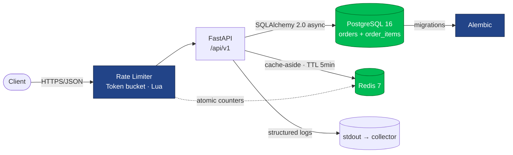

# Order Processing Platform

> Part of the [jotive.dev](https://dev.jotive.com.co) technical portfolio — Senior Backend Engineer work.

Production-grade order processing backend. Not a CRUD exercise: each architectural decision is justified with trade-offs and documented as an Architecture Decision Record (ADR).

---

## What this demonstrates

- **API Design:** REST with idempotency keys, cursor pagination, standardized error handling (RFC 7807), versioning strategy
- **SQL Modeling:** Schema design for transactional integrity, indexes for real query patterns, migration strategy with Alembic
- **Caching:** Read-through and write-through strategies, TTL and event-based invalidation, Redis as cache vs data store
- **Observability:** Structured logging, Prometheus metrics, OpenTelemetry-ready
- **Testing:** Unit, integration, and end-to-end layers with clear separation
- **Delivery:** Docker multi-stage builds, CI/CD with GitHub Actions, security hardening

---

## Stack

**Backend:** Python 3.12 · FastAPI · Pydantic v2 · SQLAlchemy 2.0
**Database:** PostgreSQL 16 · Alembic migrations
**Cache:** Redis 7
**Runtime:** Docker · docker-compose
**CI/CD:** GitHub Actions · ruff · pytest · coverage

---

## Architecture



**Request flow:**

1. Rate limiter (Redis token bucket, Lua-atomic) permits or rejects with `429 + Retry-After`.
2. Handler validates + enforces idempotency via `Idempotency-Key` header + unique DB constraint.
3. Read path: cache-aside on `order:{id}`, miss falls back to Postgres.
4. Write path: transactional DB update → cache invalidation *after* commit → 200/201 response.

See [`/docs/adr/`](./docs/adr/) for the trade-off analysis behind each of these choices.

---

## Architecture Decision Records

All non-trivial decisions live in [`/docs/adr/`](./docs/adr/).

| ADR | Decision | Status |
|---|---|---|
| [001](./docs/adr/ADR-001-api-versioning.md) | API versioning via URL path | Accepted |
| [002](./docs/adr/ADR-002-cursor-pagination.md) | Cursor-based pagination | Accepted |
| [003](./docs/adr/ADR-003-postgresql-over-mongodb.md) | PostgreSQL over MongoDB | Accepted |
| [004](./docs/adr/ADR-004-caching-and-rate-limiting.md) | Caching + rate limiting via Redis | Accepted |
| 005 | Testing pyramid scope | Pending |

---

## Local development

```bash
# Requirements: Docker Desktop, Python 3.12+

make up                               # builds + starts api + Postgres 16 + Redis 7
make migrate                          # alembic upgrade head
make logs                             # tail api logs
make down                             # stop stack
```

API at `http://localhost:8000`. OpenAPI docs at `/docs`. Liveness probe at `/health`.

See [`PROGRESS.md`](./PROGRESS.md) for the current build log.

---

## Author

**[Jotive.dev](https://dev.jotive.com.co)** — Senior Backend Engineer
[GitHub](https://github.com/jotive) · [LinkedIn](https://www.linkedin.com/in/jotive/)

---

## License

MIT
